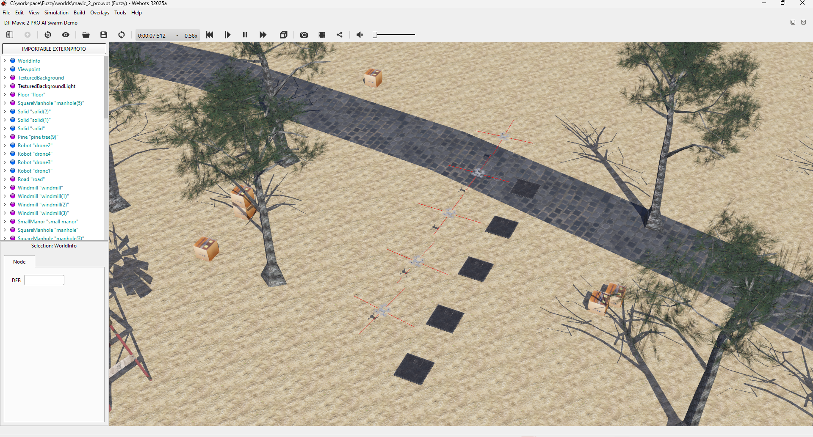
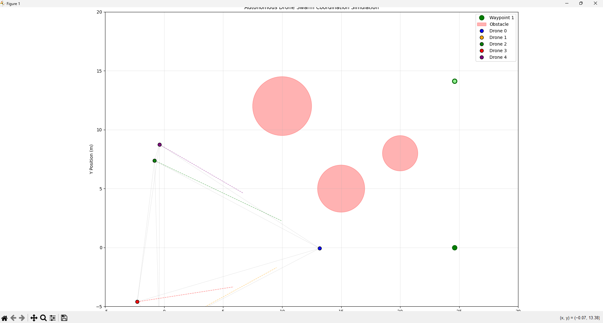

# Fuzzy-AI Autonomous Drone Swarm Coordination System

This project simulates and controls a swarm of autonomous drones using fuzzy logic, the Boids algorithm, and deep reinforcement learning (PPO). It supports both 2D/3D custom simulations and integration with the Webots robotics simulator.

---

## Features
- **Swarm Coordination:** Decentralized control using Boids and fuzzy logic.
- **Obstacle Avoidance:** Fuzzy logic-based real-time avoidance.
- **Formation Control:** Leader-follower and V-formation behaviors.
- **Goal Navigation:** Shared waypoint management.
- **Deep RL Integration:** PPO agent for advanced swarm behaviors.
- **Webots Support:** 3D simulation with realistic physics.
- **Evaluation & Logging:** Metrics and logs for analysis.

---

## Screenshots




## Project Structure

```
Fuzzy/
│
├── agents/                  # Core agent logic (Boids, fuzzy controllers, config)
│   ├── boids.py
│   ├── fuzzy_controller.py
│   └── ...
│
├── controllers/             # Simulation and RL controllers
│   ├── mavic_controller/    # Webots Mavic2Pro controllers
│   ├── multi_agent_sim/     # Multi-agent simulation scripts
│   └── my_rl_supervisor/    # RL supervisor, PPO training, fuzzy policies
│
├── configs/                 # Configuration files
│
├── eval/                    # Logging and evaluation scripts
│
├── libraries/               # External or custom libraries
│
├── plugins/                 # Webots plugins (physics, remote controls, etc.)
│
├── protos/                  # Webots PROTO files (drone models)
│
├── results/                 # Simulation and experiment results
│
├── tests/                   # Test scripts for simulation and logic
│
├── tools/                   # Utility scripts (waypoint picker, etc.)
│
├── worlds/                  # Webots world files
│
├── run.py                   # Main entry point for custom simulation
├── README.md                # Project documentation (this file)
└── ...
```

---

## Getting Started

### 1. **Install Requirements**
- Python 3.8+
- `numpy`, `matplotlib`, `scikit-fuzzy`, `stable-baselines3`, `webots` (if using Webots)

```
pip install -r requirements.txt
```

### 2. **Run 2D/3D Simulations**
- Run custom simulation:
  ```
  python run.py
  ```
- Run test scripts in `tests/` for specific behaviors.

### 3. **Webots Simulation**
- Open the project in Webots.
- Load a world from `worlds/` and run the supervisor/controller.

### 4. **Train or Run RL Agent**
- Train PPO agent:
  ```
  python controllers/my_rl_supervisor/train.py
  ```
- Run RL supervisor in Webots:
  ```
  python controllers/my_rl_supervisor/ai_supervisor.py
  ```

---

## Key Files & Folders
- `agents/boids.py` — Boids algorithm for flocking
- `agents/fuzzy_controller.py` — Fuzzy logic for avoidance and blending
- `controllers/my_rl_supervisor/` — RL supervisor, PPO training, fuzzy policies
- `run.py` — Main simulation entry point
- `tests/` — Test scripts for movement, formation, and avoidance
- `protos/` — Webots drone models
- `worlds/` — Webots world files

---

## Citation
If you use this project for research, please cite appropriately.

---

## License
MIT License

